# Inbound EDI Tutorial (in-depth)

## I. Introduction

The goal of this tutorial is to deploy a simple serverless system that ingests an EDI file and outputs a JSON. It sounds simple, but at Stedi we like to say that [reality has a surprising amount of detail](http://johnsalvatier.org/blog/2017/reality-has-a-surprising-amount-of-detail). Luckily we have Stedi to do the heavy lifting of translating and transforming the EDI into a JSON to a shape of our choosing. For a deeper overview of Stedi, visit [Introduction to Stedi.](https://www.stedi.com/docs/getting-started/introduction-to-stedi)

**At a high level**, we need something that…

1. Gets an EDI file as data.

2. Translates that EDI to JSON EDI (JEDI) making it easier to inspect/parse/modify the data.

3. Maps that JEDI to a specific JSON.

4. Write that JSON back into S3.

### Ia. Required resources

For this tutorial you will need:

- The Terraform CLI (1.0.1+) installed.

- An AWS account.

- The AWS CLI (2.0+), and configured for your AWS account.

- A Stedi account (an API key created).

## II. Breakdown of the components

Stedi has two components we need: EDI Core (the service that translates EDI files to JEDI), and Mapping (the service that maps JSON-to-JSON). Used in a sequence we can string together the following transformation **EDI -> JEDI -> JSON.** \
 \
 To interact with EDI Core and Mappings, Stedi exposes both via REST API (link to docs). \
 \
 We need something that i) gets an EDI payload and ii) calls the Stedi EDI Core and Mappings APIs. For that, we’ll use a serverless Lambda function that receives the EDI and makes those two calls.

To interact with Lambda, we need a way to send requests to it over the network - so we’ll connect S3 for storage together with Lambda. When an EDI file appears in the S3 bucket, it will trigger the Lambda that will get the file, transform it, and place it back in S3.

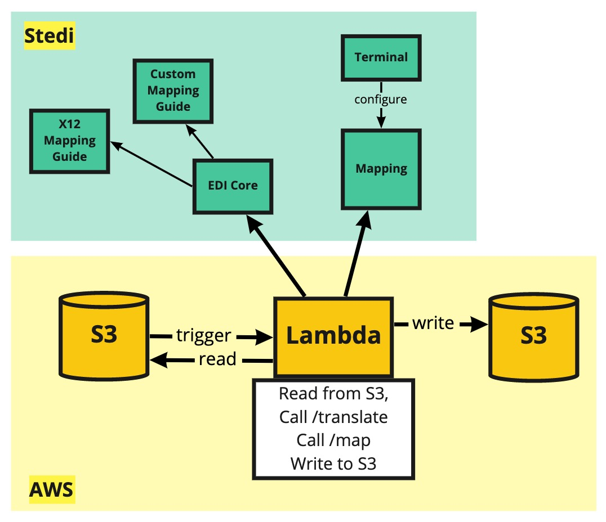

### IIa. Why Terraform when we’re deploying to AWS?

Terraform is an Infrastructure-as-Code (IaC) tool that allows you to manage infrastructure with configuration files rather than a GUI. While these IaC tools exist for specific cloud providers, Terraform is cloud provider agnostic and with minor changes can be modified to deploy to Azure, GCP, Alibaba Cloud, Heroku, and Oracle Cloud.

## III. Steps

AWS can be intimidating. Let’s make it easier by illustrating what we’re trying to accomplish.

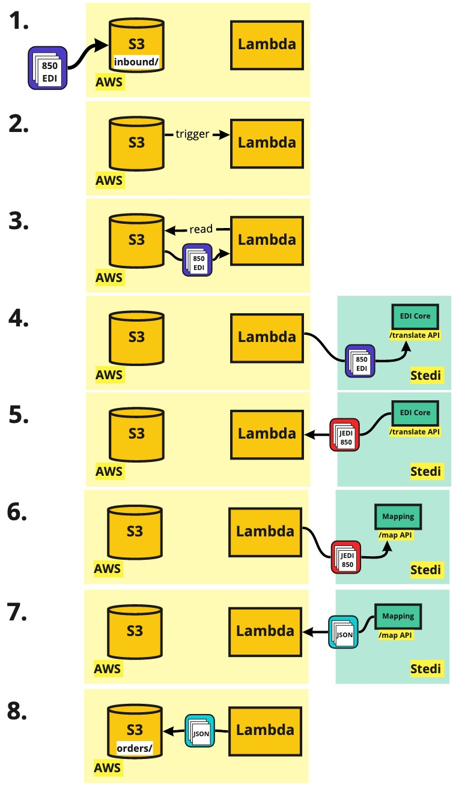

We’re passing an 850 EDI file into an S3 bucket folder called `inbound/`. The S3 bucket triggers a Lambda that comes and gets the 850 EDI file. The Lambda then calls Stedi’s `/translate` API with the EDI 850 file, which returns an 850 JEDI file to the Lambda.

Then the Lambda calls Stedi’s `/map` API with the JEDI 850 which returns the transformed JSON. The `/map` API knows which mapping to use because we provide a mapping ID. The Mapping is created in Stedi’s terminal UI. After the Lambda receives a JSON back from `/map`, it puts it into the S3 bucket under a folder called `orders/`. That’s it.

### IIIa. AWS Components

We have several things to create in AWS. I’ll describe them here, but we’ll use Terraform to define them and deploy them to the AWS account.

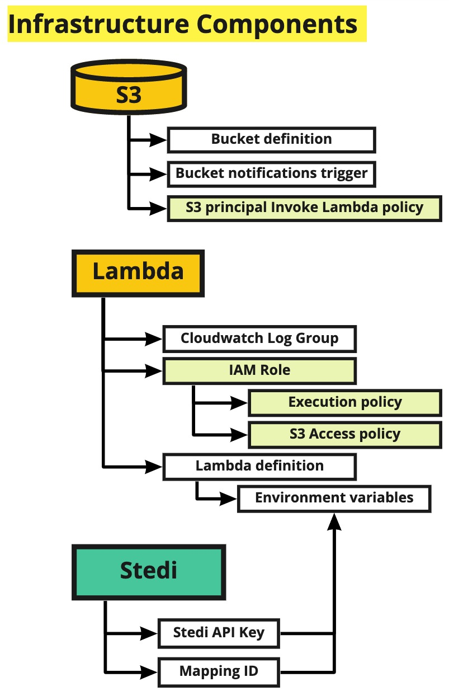

This is a quick breakdown. All of the above is defined in Terraform in `main.tf`.

## IV. Let’s get started

We’re starting with a skeleton repo - clone from **[https://github.com/Stedi/tutorials](https://github.com/Stedi/tutorials)**

On your CLI, you can run '''git clone https://github.com/Stedi/tutorials.git'''

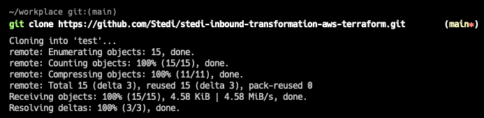

Then change directory using `cd tutorials/stedi-inbound-transformation-aws-terraform`

The project structure is as follows;

```bash
├── scripts
│   └── setup.sh	// Shell script for creating lambda .zip
├── index.js		// Main Lambda code that does all the magic
│
├── main.tf		// Core terraform infrastructure is written here
├── variables.tf	// String variables for terraform
│
├── 850.edi		// Our X12 850 EDI file
│
└── package.json	// (To download @axios when we run npm install)
```

### IVa. Let’s focus on `main.tf`.

In part one, we’re defining some providers that help terraform run. The required_provider aws lets us deploy to AWS, and the random provider is a helper to create random text.

```js
# I. Terraform specific
terraform {
 required_providers {
   aws = {
     source  = "hashicorp/aws"
     version = "= 3.48.0"
   }
   random = { # This gives us random strings, it's useful below.
     source  = "hashicorp/random"
     version = "= 3.1.0"
   }
 }

 required_version = "~> 1.0"
}

provider "aws" {
 region = var.aws_region
}
```

In part two, we start with defining the main role for the Lambda function to use. We attach two policies to that role, one for writing to CW log groups (that we declare below too), and another for having read/write access to S3. Finally, we give the S3 principal the ability to trigger our Lambda (we’re not permitting any role but rather to the _S3 service itself_).

```js
# II. Lambda

# Create a role for lambda
resource "aws_iam_role" "iam_for_lambda" {
 name = "iam_for_lambda"

 assume_role_policy = jsonencode({
   Version = "2012-10-17"
   Statement = [{
     Action = "sts:AssumeRole"
     Effect = "Allow"
     Sid    = ""
     Principal = {
       Service = "lambda.amazonaws.com"
     }
     }
   ]
 })
}

# Attaches a policy that allows writing to CW Logs, for the role
resource "aws_iam_role_policy_attachment" "lambda_policy" {
 role       = aws_iam_role.iam_for_lambda.name
 policy_arn = "arn:aws:iam::aws:policy/service-role/AWSLambdaBasicExecutionRole"
}

# Ataches a policy that allows read/write to S3, for the role
resource "aws_iam_role_policy_attachment" "lambda_s3_policy" {
 role       = aws_iam_role.iam_for_lambda.name
 policy_arn = "arn:aws:iam::aws:policy/AmazonS3FullAccess"
}

# The CW Log group itself
resource "aws_cloudwatch_log_group" "stedi_lambda" {
 name = "/aws/lambda/${aws_lambda_function.stedi_lambda.function_name}"
}

# Another permission so the S3 bucket can trigger the Lambda.
resource "aws_lambda_permission" "allow_bucket" {
 statement_id  = "AllowExecutionFromS3Bucket"
 action        = "lambda:InvokeFunction"
 function_name = aws_lambda_function.stedi_lambda.arn
 principal     = "s3.amazonaws.com"
 source_arn    = aws_s3_bucket.bucket.arn
}
```

Then we define our core Lambda. We define our runtime as nodejs. The handler needs to be the name of your main code file. If our main file was named “bob”, we’d set this to be `handler = “bob.handler”.` In our case, it’s `index.js` so we set `handler = “index.handler`.

Next, we’ve chosen to upload our Lambda code as a .zip file. There are other ways (using terraform archives), but this is a simple case. We’ll have to make sure our Lambda code is .zipped up and in the `/tmp/` directory for this to run. Luckily, the `scripts/setup.sh` script takes care of this, we just have to run that before we deploy this terraform.

We also define a `source_code_hash` which will check if the .zip file is updated, and redeploy the Lambda if it is.

Lastly, our Lambda will call Stedi APIs. Those calls need some configuration, so we define them as environment variables in the Lambda. This way, we can pass secrets and strings to the Lambda and the runtime will have access to it.

```js
# MAIN LAMBDA - Resources defines lambda using source code uploaded to S3 in .zip.
resource "aws_lambda_function" "stedi_lambda" {
 function_name = "StediLambda"

 runtime = "nodejs12.x"
 handler = "index.handler"

 # Where the setup.sh puts the Lambda file .zip
 filename = "/tmp/index.zip"

 # This auto-trigger Lambda updates whenever we change the code!
 source_code_hash = filebase64sha256("/tmp/index.zip")

 timeout = 30 # lambda timeout to 30 seconds.

 # Important environment variables for calling Stedi APIs
 environment {
   variables = {
     stedi_api_key = var.stedi_api_key,
     stedi_mapping_id = var.stedi_mapping_id
   }
 }

 role = aws_iam_role.iam_for_lambda.arn
}
```

In part three, we define our bucket to auto generate with random (and sometimes comical) names such as **panda-obviously-moved-zebra.** Because S3 names are global (all AWS customers worldwide), we have to ensure we have a unique name or risk the deployment failing.

```js
# III. S3
resource "random_pet" "random_bucket_name" {
 prefix = var.project_name
 length = 3
}

resource "aws_s3_bucket" "bucket" {
 bucket = random_pet.random_bucket_name.id

 acl           = "private"
 force_destroy = true
}

resource "aws_s3_bucket_notification" "bucket_notification" {
 bucket = aws_s3_bucket.bucket.id

 lambda_function {
   lambda_function_arn = aws_lambda_function.stedi_lambda.arn
   events              = ["s3:ObjectCreated:*"]
   filter_prefix       = "inbound/"
   filter_suffix       = ".edi"
 }

 depends_on = [aws_lambda_permission.allow_bucket]
}
```

Importantly, we define an S3 bucket notification to trigger our Lambda. `["s3:ObjectCreated:*"]` means it will trigger only on object creation events. And this notification triggers only in the `inbound/` folder for files with the `.edi` ending. So a file in `inbound/my-850-file.edi` will invoke our Lambda.

**Note:** when S3 notifications trigger a Lambda, it also passes the following object:

```js
"Records": [
  {
    "eventVersion": "2.1",
    "eventSource": "aws:s3",
    "awsRegion": "us-east-1",
    "eventTime": "2021-12-17T19:04:15.899Z",
    "eventName": "ObjectCreated:Put",
    ...
    "s3": {
      "s3SchemaVersion": "...",
      "configurationId": "trigger-lambda",
      "bucket": {
        "name": "panda-obviously-moved-zebra",			// <- Bucket name
        "ownerIdentity": {
          "principalId": "..."
        },
        "arn": "arn:aws:s3::panda-obviously-moved-zebra"
      },
      "object": {
        "key": "inbound/my-850-file.edi",			// <- File name
        "size": 393,
        "eTag": "...",
        "sequencer": "..."
      }
    }
  }
]
```

This makes life easy because that means the Lambda gets the name of the bucket & file when it’s triggered so it can immediately make a call to S3 to read the file. No extra steps.

### IVb. Let’s focus on `index.js`

This is the main Lambda function. It has four main parts.

```js
const AWS = require("aws-sdk");
const s3 = new AWS.S3();
const axios = require("axios");

// Get environment variables
const apiKey = process.env.stedi_api_key;
const mapId = process.env.stedi_mapping_id;

// Create axios client to Stedi services
const axiosClient = axios.create({
  headers: {
    Authorization: `Key ${apiKey}`,
    "Content-Type": "application/json",
  },
});

module.exports.handler = async (event, context) => {
  console.log("Event: ", JSON.stringify(event));

  try {
    // 1. Get file from S3 bucket
    const Bucket = event.Records[0].s3.bucket.name;
    const data = await getFileFromS3(Bucket, event);

    // 2. Call /translate to transform 850 EDI -> JEDI 850
    const translateResponse = await translateEDI(data.Body.toString("ascii"));

    // 3. Call /map to transform JEDI 850 -> Purchase Order JSON
    const mappingResponse = await mapJEDI(translateResponse.jedi);

    // 4. Put the Purchase Order JSON into S3 under the folder orders/
    const writeResult = await putFileIntoS3(
      Bucket,
      mappingResponse.purchase_order
    );

    // 5. End lambda
    return {
      statusCode: 200,
      body: JSON.stringify({
        message: "Stedi Lambda succeeded!",
        result: writeResult,
      }),
    };
  } catch (e) {
    return {
      statusCode: 500,
      body: JSON.stringify({
        message: e,
      }),
    };
  }
};
```

**Part 1.** uses the Bucket and Filename to get the data inside the file from S3 using the S3 SDK call `getObject()`

```js
async function getFileFromS3(Bucket, event) {
  try {
    const Key = decodeURIComponent(
      event.Records[0].s3.object.key.replace(/\+/g, " ")
    );
    return await s3.getObject({ Bucket, Key }).promise();
  } catch (e) {
    console.log(e);
  }
}
```

**In Part 2.** The file is read, and the following request is created to the shape of the [`/translate` API](https://www.stedi.com/docs/api/edi-core#translate) from Stedi.

**Note:** in the `input` field is an ugly string. That ugly string is the X12 850 EDI.

```js
{
 "input_format": "edi",
 "input": "ISA*00*          *00*          *ZZ*STEDI          *ZZ*ACME           *210901*1234*U*00801*000000001*0*T*>~GS*PO*SENDERGS*007326879*20210901*1234*1*X*008020~ST*850*000000001~BEG*24*SP*PO-00001**20210901~N1*2L*STEDI INC.~REF*K6*A composable platform for building flexible EDI systems~PER*SR**EA*team@stedi.com~PO1**1*2P*0.0001*PE*GE*EDI Core~PO1**1*C0*0.05*PE*GE*Mappings~CTT*2~SE*9*000000001~GE*1*1~IEA*1*000000001~",
 "output_format": "jedi@2.0-beta"
}
```

That **POST** request is sent to the `/translate` endpoint.

```js
async function translateEDI(edi_data) {
  try {
    const response = await axiosClient.request({
      method: "POST",
      url: "https://edi-core.stedi.com/2021-06-05/translate",
      data: {
        input_format: "edi",
        input: edi_data,
        output_format: "jedi@2.0-beta",
      },
    });
    const jedi = response.data;
    console.log("/translate RESP", JSON.stringify(jedi, null, 2));

    return {
      statusCode: 200,
      jedi,
    };
  } catch (e) {
    console.log(e);
  }
}
```

**In Part 3,** the response from `/translate` is received and looks like the following. This is an X12 850 JEDI (JSON-EDI). This JSON is a lossless representation of the X12 850 EDI data.

```json
{
  "code": "valid",
  "output": {
    "interchanges": [
      {
        "interchange_control_header_ISA": {
          "authorization_information_qualifier_01": "no_authorization_information_present_no_meaningful_information_in_i02_00",
          "authorization_information_02": "",
          "security_information_qualifier_03": "no_security_information_present_no_meaningful_information_in_i04_00",
          "security_information_04": "",
          "interchange_id_qualifier_05": "mutually_defined_ZZ",
          "interchange_sender_id_06": "STEDI",
          "interchange_id_qualifier_07": "mutually_defined_ZZ",
          "interchange_receiver_id_08": "ACME",
          "interchange_date_09": "210901",
          "interchange_time_10": "1234",
          "repetition_separator_11": "U",
          "interchange_control_version_number_code_12": "00801",
          "interchange_control_number_13": "000000001",
          "acknowledgment_requested_code_14": "no_interchange_acknowledgment_requested_0",
          "interchange_usage_indicator_code_15": "test_data_T",
          "component_element_separator_16": ">"
        },
        "groups": [
          {
            "functional_group_header_GS": {
              "functional_identifier_code_01": "purchase_order_850_PO",
              "application_senders_code_02": "SENDERGS",
              "application_receivers_code_03": "007326879",
              "date_04": "20210901",
              "time_05": "1234",
              "group_control_number_06": "1",
              "responsible_agency_code_07": "accredited_standards_committee_x12_X",
              "version_release_industry_identifier_code_08": "008020"
            },
            "transaction_sets": [
              {
                "heading": {
                  "transaction_set_header_ST": {
                    "transaction_set_identifier_code_01": "850",
                    "transaction_set_control_number_02": "000000001"
                  },
                  "beginning_segment_for_purchase_order_BEG": {
                    "transaction_set_purpose_code_01": "draft_24",
                    "purchase_order_type_code_02": "sample_SP",
                    "purchase_order_number_03": "PO-00001",
                    "date_05": "20210901"
                  },
                  "party_identification_N1_loop": [
                    {
                      "party_identification_N1": {
                        "entity_identifier_code_01": "corporation_2L",
                        "name_02": "STEDI INC."
                      },
                      "reference_information_REF": [
                        {
                          "reference_identification_qualifier_01": "purchase_description_K6",
                          "reference_identification_02": "A composable platform for building flexible EDI systems"
                        }
                      ],
                      "administrative_communications_contact_PER": [
                        {
                          "contact_function_code_01": "sales_representative_or_department_SR",
                          "communication_number_qualifier_03": "internet_email_address_EA",
                          "communication_number_04": "team@stedi.com"
                        }
                      ]
                    }
                  ]
                },
                "detail": {
                  "baseline_item_data_PO1_loop": [
                    {
                      "baseline_item_data_PO1": {
                        "quantity_02": "1",
                        "unit_or_basis_for_measurement_code_03": "kilobyte_2P",
                        "unit_price_04": "0.0001",
                        "basis_of_unit_price_code_05": "price_per_each_PE",
                        "product_service_id_qualifier_06": "generic_name_description_GE",
                        "product_service_id_07": "EDI Core"
                      }
                    },
                    {
                      "baseline_item_data_PO1": {
                        "quantity_02": "1",
                        "unit_or_basis_for_measurement_code_03": "calls_C0",
                        "unit_price_04": "0.05",
                        "basis_of_unit_price_code_05": "price_per_each_PE",
                        "product_service_id_qualifier_06": "generic_name_description_GE",
                        "product_service_id_07": "Mappings"
                      }
                    }
                  ]
                },
                "summary": {
                  "transaction_totals_CTT_loop": [
                    {
                      "transaction_totals_CTT": {
                        "number_of_line_items_01": "2"
                      }
                    }
                  ],
                  "transaction_set_trailer_SE": {
                    "number_of_included_segments_01": "9",
                    "transaction_set_control_number_02": "000000001"
                  }
                },
                "set": "850"
              }
            ],
            "functional_group_trailer_GE": {
              "number_of_transaction_sets_included_01": "1",
              "group_control_number_02": "1"
            },
            "release": "008020"
          }
        ],
        "interchange_control_trailer_IEA": {
          "number_of_included_functional_groups_01": "1",
          "interchange_control_number_02": "000000001"
        },
        "delimiters": {
          "element": "*",
          "segment": "~",
          "sub_element": ">"
        }
      }
    ],
    "__version": "jedi@2.0-beta"
  }
}
```

Then the `mapJEDI(jedi_data)` function receives and sends a second POST request to the [`/map` API](https://www.stedi.com/docs/api/mappings#MapDocument) from Stedi. \
**Note**: the mapId is taken from the environment variables. This means the mapping must already be created in the Stedi Terminal.

```js
async function mapJEDI(jedi_data) {
  try {
    const response = await axiosClient.request({
      method: "POST",
      url: "https://mappings.stedi.com/2021-06-01/mappings/" + mapId + "/map",
      data: jedi_data,
    });

    const purchase_order = response.data;
    console.log("/map RESP", JSON.stringify(purchase_order, null, 2));

    return {
      statusCode: 200,
      purchase_order,
    };
  } catch (e) {
    console.log(e);
  }
}
```

And in return, we get back a much simpler JSON that we’ll call our purchase_order.

```js
{
 "po_number": "PO-00001",
 "sender_id": "STEDI",
 "interchange_receiver_id_08": "ACME"
}
```

**Finally, in Part 4** we will write the purchase_order JSON back into S3 in a folder named `orders/`. The name of the file will be the po_number joined with a random number. E.g. PO-00001-98.json. This is written to S3 using the S3 SDK call `putObject()`.

```js
async function putFileIntoS3(Bucket, purchase_order) {
  try {
    const objectName = `orders/${await purchase_order.po_number}-${Math.floor(
      Math.random() * 100
    )}.json`;

    const stringifiedData = JSON.stringify(purchase_order, null, 2); // Need this because putObject only accepts string type
    const s3PutObjectParams = {
      Bucket,
      Key: objectName,
      Body: stringifiedData,
      ContentType: `application/json`,
    };
    const result = await s3.putObject({ ...s3PutObjectParams }).promise();
    console.log(
      `File uploaded successfully at https:/` +
        Bucket +
        `.s3.amazonaws.com/` +
        objectName
    );
  } catch (e) {
    console.log(e);
  }
}
```

## V. Deploy and execute

Once you’ve cloned the repo, run `./scripts/setup.sh`.

This will run `terraform init` to download terraforms providers, then run `npm install` to download Axios, and finally, it will zip the Lambda and the npm dependencies (only Axios in our case) into a single `index.zip` into the `/tmp/` directory.

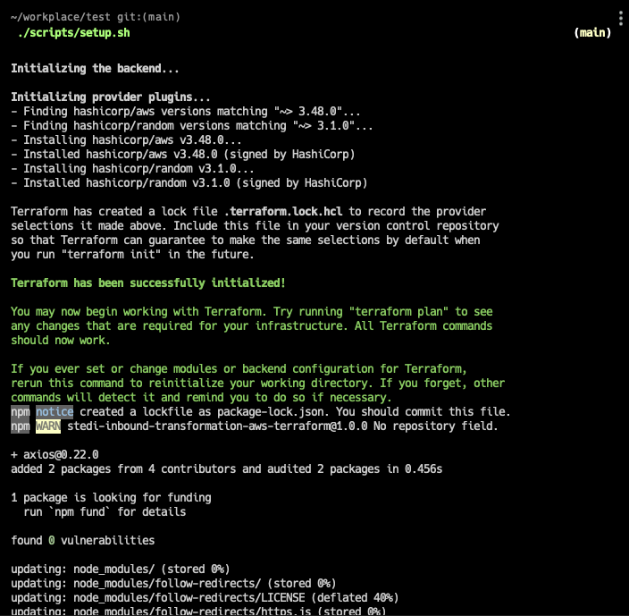

\
Now to execute make sure your AWS profile is correctly configured for the AWS CLI.

Then run `terraform apply`. You will be prompted to enter:

1. Your Stedi API key (you can get this by following the [https://www.stedi.com/docs/authentication](https://www.stedi.com/docs/authentication))
2. Your Mapping ID. For this tutorial, we will use the Mapping ID from the &lt;850 JEDI to JSON tutorial> [https://www.stedi.com/docs/mappings](https://www.stedi.com/docs/mappings). \

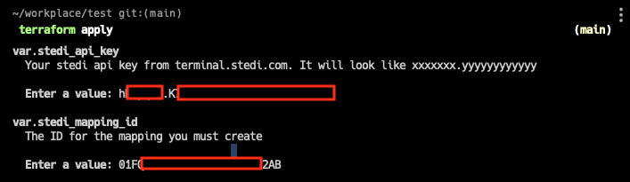

\
You can get the API key from terminal.stedi.com/o/?/apikeys:

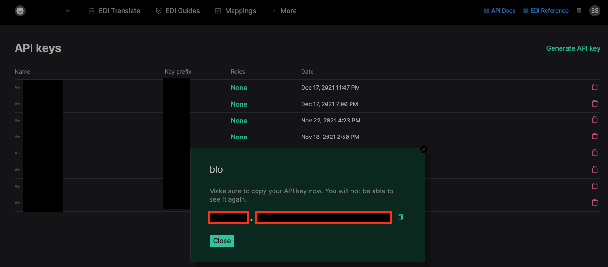

\
**To create a Mapping, and get the ID.**

1. Navigate to terminal.stedi.com > Mappings

2. Click ‘Create Mapping’ to begin the wizard.

3. For the Source Schema: Copy-and-paste the output JSON from the /translate call shown above in** IVb.)**

4. For the Target Schema: Copy-and-paste the following

```js
{
  "po_number": "xxxxx",
  "sender_id": "xxxxx",
  "interchange_receiver_id_08": "xxxxx"
}
```

5. For “Add Keys to Target Map”: Select all keys.

6. For the “po_number” mapping:

```
output.interchanges[0].groups[0].transaction_sets[0].heading.beginning_segment_for_purchase_order_BEG.purchase_order_number_03
```

7. For the “sender_id” mapping:

```
output.interchanges[0].interchange_control_header_ISA.interchange_sender_id_06
```

8. For the “interchange_receiver_id_08” mapping:

```
output.interchanges[0].interchange_control_header_ISA.interchange_receiver_id_08
```

9. Save the mapping, and get the Mapping ID from

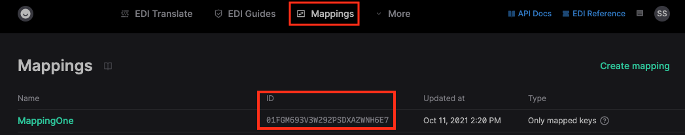

Once you’ve entered those values into the CLI prompt, hit enter and you will see the following screen:

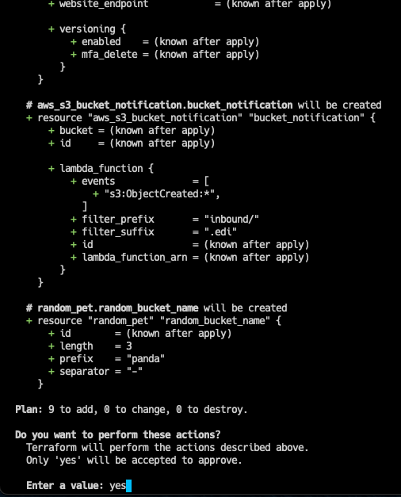

Type “yes” and hit enter. This will deploy to your AWS account. If you encounter any failures, they are likely due to a misconfiguration of your AWS profile in the shell.

On success, you should see:

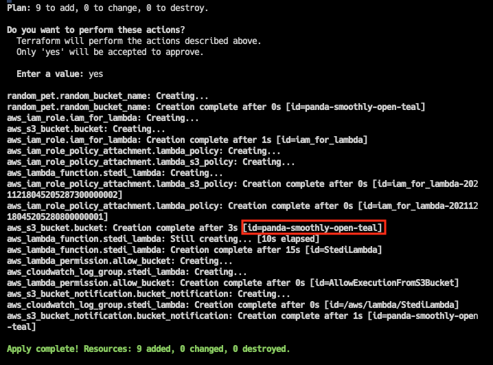

**Note:** the name of our bucket in this instance is `panda-smoothly-open-teal`.

Let’s navigate to the AWS Console and create a folder called `inbound/`. Navigate inside the `inbound/` folder, and upload the `850.edi` file that was shared inside the git repository.

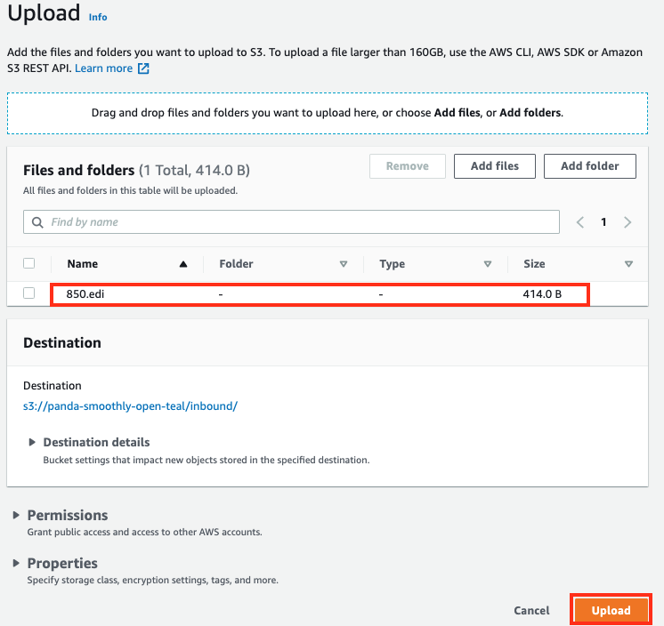

Now go back to the root of the bucket and click `Refresh`. You should see a new folder pop up called `orders/`.

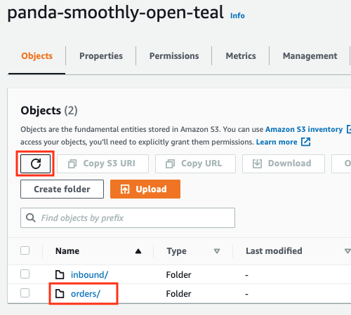

Inside that folder, we’ll find a JSON file that’s the output of the workflow we coded in that Lambda.

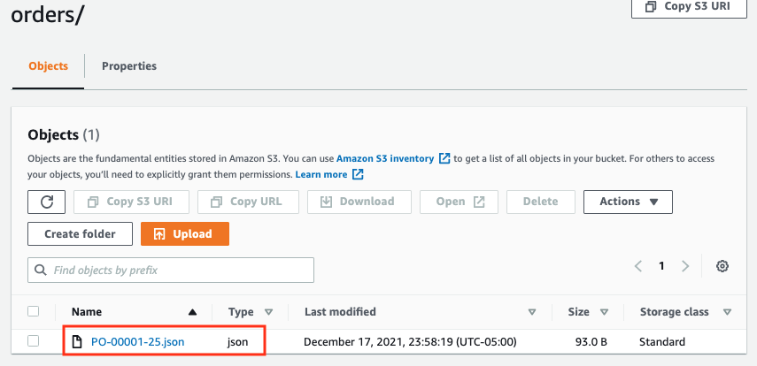

Opening that file, we can confirm it looks like the JSON payload we were expecting.

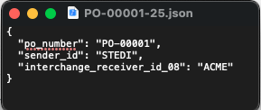

Congratulations, you completed the workshop assignment succesfully!

## VI. Final thoughts

In order to monitor if the solution is running correctly, you can take a look at the CloudWatch Metrics of the Lambda function. Over here, you can see how many successful invocations happened and inspect the duration of these requests.

This concludes our workshop, but please feel free to extend and modify this stack further. You can try to process your own EDI files with the solution and explore different mappings that can be made.

## VII. Cleaning up the resources on AWS

If you’d like to tear down and clean up your AWS account, run `terraform destroy` and it will remove everything including the data in the files.

We hope you enjoyed this tutorial on how to implement a workflow on AWS and calling Stedi to do data transformations, and we hope this makes the journey towards implementation clearer.

As always, Stedi is evolving, so if you have any thoughts or feedback **we would love to hear from you**!
